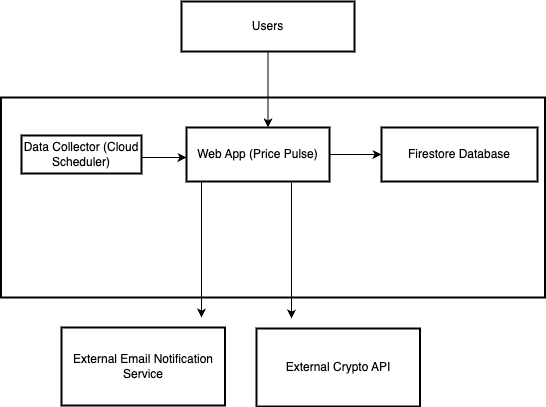

# PricePulse 📈

PricePulse is a cloud-native service designed to help cryptocurrency investors monitor market movements. It features a web interface for creating price-change signals, fetches real-time market data, evaluates it against user signals, and delivers instant email notifications when a threshold is met.

---

### Architecture



---

## Deployment URL
https://pricepulse-399338887657.us-central1.run.app

---

## Core Features
- **Integrated Web UI**: A simple, server-rendered user interface for creating and viewing price signals.
- **RESTful API**: Endpoints for programmatic management of users and signals.
- **Email Notifications**: Delivers real-time alerts via SendGrid when signals are triggered.
- **Automated Data Polling**: Uses Cloud Scheduler to reliably fetch data in the background.
- **Real-Time Data**: Fetches live cryptocurrency prices from the CoinGecko API.
- **Persistent Storage**: Uses Google Firestore to store all application data.
- **Tested**: Includes a suite of unit and integration tests for core business logic.
- **Containerized**: A Dockerfile is included for building and deploying in a production environment.
- **Health Monitoring**: A `/health` endpoint for uptime monitoring.

---

## Prerequisites
Before you can run this project locally, ensure you have the following tools installed:
- **Go**: The programming language used for this application. [Download Go](https://golang.org/dl/)
- **Google Cloud SDK (gcloud)**: Required to run the local Firestore emulator. [Installation Guide](https://cloud.google.com/sdk/docs/install)
- **Docker Desktop (Optional)**: Used for building the container to deploy the application. [Download Docker](https://www.docker.com/products/docker-desktop/)

---

## Environment Variables
The application requires the following environment variables to be set:

| Variable               | Purpose                                      | Local Usage                          | Production Usage (Cloud Run)       |
|------------------------|----------------------------------------------|--------------------------------------|------------------------------------|
| `GCP_PROJECT`          | Your Google Cloud Project ID.               | Optional (defaults to a test ID).    | Required. Set automatically.       |
| `PORT`                 | The port the web server listens on.         | Optional (defaults to 8080).         | Required. Set automatically by Cloud Run. |
| `FIRESTORE_EMULATOR_HOST` | The address of the local Firestore emulator. | Required. Set to `localhost:8081`.   | Must NOT be set.                   |
| `SENDGRID_API_KEY`     | Your API key for the SendGrid service.      | Optional. Set if you want to test emails locally. | Required. Set from Secret Manager. |
| `SENDGRID_FROM_EMAIL`  | The "From" email address, which must be a Verified Sender in SendGrid. | Optional. Set if you want to test emails locally. | Required. Set as an environment variable. |

---

## Running Locally
Running the application locally requires two terminal windows: one for the database emulator and one for the Go application.

### 1. Start the Firestore Emulator
In your first terminal window, start the local Firestore emulator. This terminal must remain open.

```bash
gcloud emulators firestore start --host-port="localhost:8081"
```

### 2. Run the Go Application
In a second terminal window, navigate to the project directory and run the application. Set the `FIRESTORE_EMULATOR_HOST` so the app connects to your local emulator.

#### On macOS or Linux:
```bash
FIRESTORE_EMULATOR_HOST="localhost:8081" go run .
```

#### On Windows (Command Prompt):
```cmd
set FIRESTORE_EMULATOR_HOST=localhost:8081
go run .
```

You should see a log message that the server has started. You can now access the web UI by navigating to [http://localhost:8080](http://localhost:8080) in your browser.

---

## Running Tests
The integration tests also require the Firestore emulator to be running.

### 1. Ensure the Emulator is Running
Make sure your first terminal window is still running the emulator.

### 2. Run the Test Suite
In a new terminal, navigate to the project directory and run the test command, again providing the environment variable.

#### On macOS or Linux:
```bash
FIRESTORE_EMULATOR_HOST="localhost:8081" go test -v ./...
```

#### On Windows (Command Prompt):
```cmd
set FIRESTORE_EMULATOR_HOST=localhost:8081
go test -v ./...
```

---

## Technology Stack
- **Backend**: Go
- **Database**: Google Firestore
- **Deployment**: Google Cloud Run, Docker
- **Automation**: Google Cloud Scheduler
- **Notifications**: SendGrid
- **Security**: Google Secret Manager
- **External Data**: CoinGecko API
